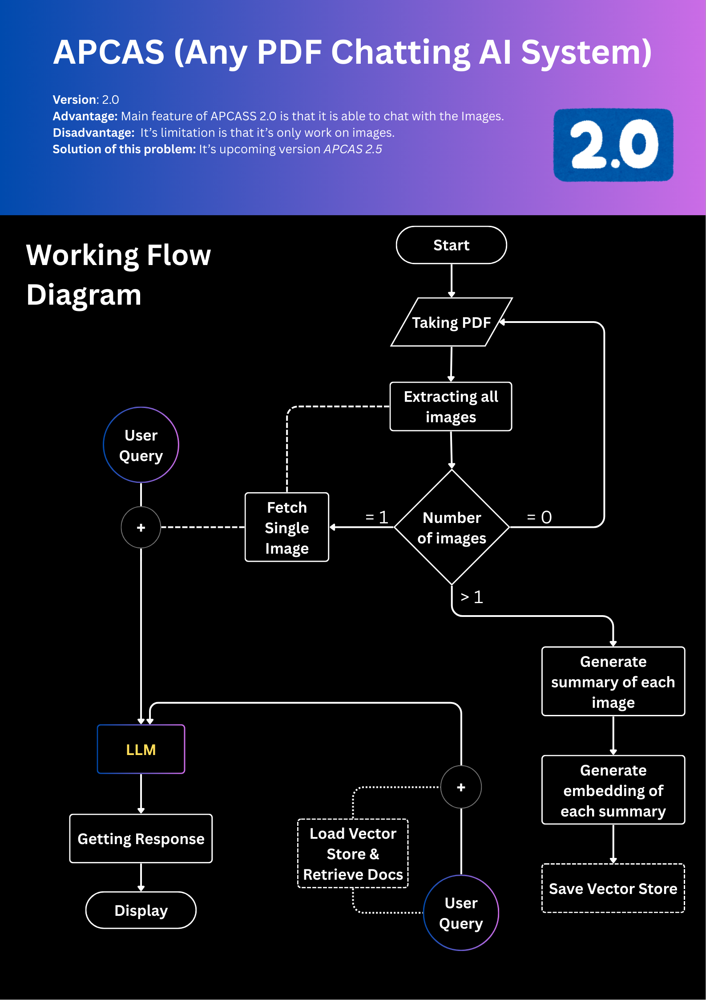

# APCAS `2.0.0` (Any PDF Chatting AI System)

 

| [Switch to Updated version `2.1.1`](https://github.com/a4archit/apcas2/tree/clip-approach) | [Live Demo of APCAS `2.1.1`](https://apcasv211.streamlit.app) |
| ----------------------------------- | ---------------------------------------------- |

 
 

APCAS stands for Any PDF Chatting AI System, it is basically a RAG (Retrieval Augmented Generation) based
application, that optimized for chatting with any PDF in an efficint way, still it is not a professional 
project So it may have several bugs.
This version works only with images.

> [Take a live demo now!](https://apcass.streamlit.app)

> [!NOTE]
> Your Ideas, Sugestions, Contributions always welcome 😃 here.

 

## Technologies used in this Project
- Langchain
- Gemini LLM APIs
- Version Control (Git & Github)
- Web Application (Using Streamlit)
- OOPs (Object Oriented Programming System)
- Python with its libraries and some more techs

## Working Flow

### Social Accounts
| [Kaggle](https://www.kaggle.com/architty108) | [Github](https://www.github.com/a4archit) | [LinkedIn](https://www.linkedin.com/in/a4archit) |
|----------------|---------------|---------------|

